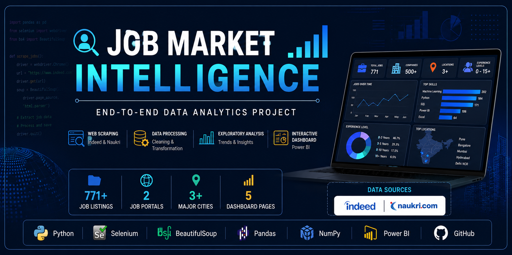
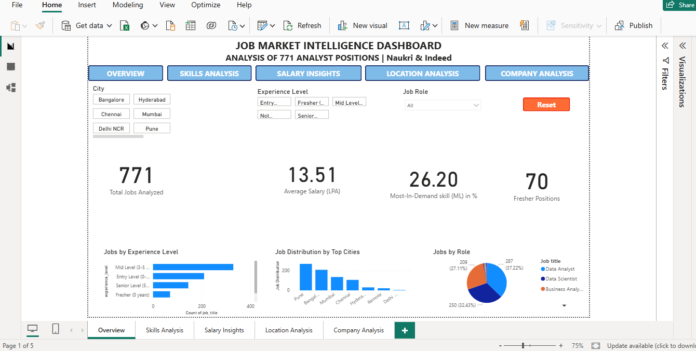
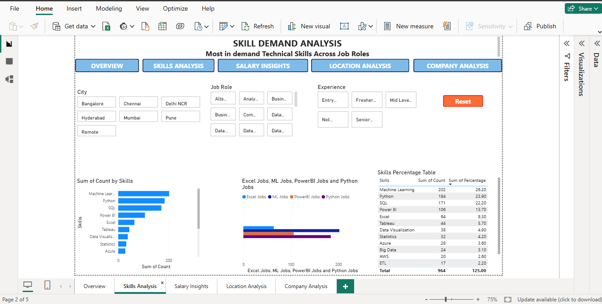
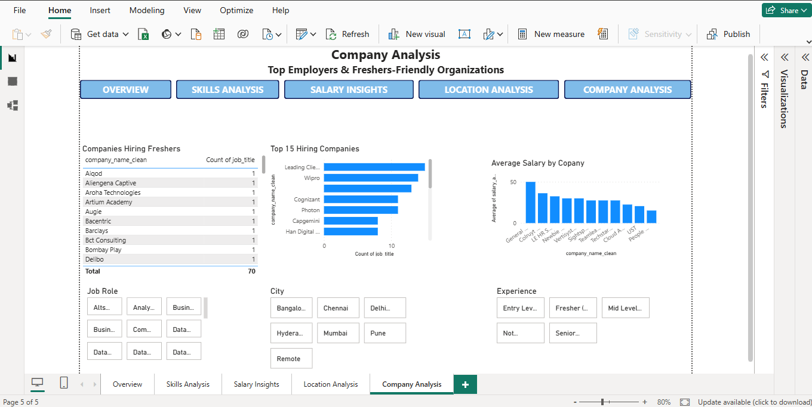
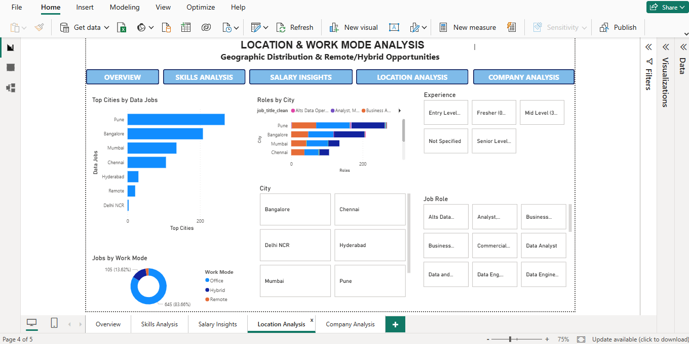

# 📊 Job Market Intelligence

<p align="center">
  
</p>

<p align="center">
  <strong>An End-to-End Data Analytics Project for Analyzing Job Market Trends in India</strong>
</p>

<p align="center">
  
  
  
  
  
  
  
</p>

---

# 📌 Project Overview

Job Market Intelligence is an end-to-end Data Analytics project that automates the collection, processing, analysis, and visualization of job postings from **Indeed India** and **Naukri.com**.

The project demonstrates the complete analytics lifecycle—from web scraping and data preprocessing to exploratory data analysis and interactive Power BI dashboards. By analyzing **771 job postings**, it uncovers hiring trends, in-demand technical skills, salary patterns, company hiring activity, and location-wise opportunities for **Data Analyst** and **Data Scientist** roles in India.

This project was developed to showcase practical skills in **Python, Web Scraping, Data Cleaning, Exploratory Data Analysis (EDA), and Business Intelligence** using real-world data.

---

# 🎯 Objectives

- Automate the collection of job postings from multiple job portals.
- Analyze hiring demand for Data Analyst and Data Scientist roles.
- Identify the most in-demand technical skills.
- Compare hiring trends across major Indian cities.
- Analyze salary information where available.
- Identify the companies hiring the most data professionals.
- Present insights through an interactive Power BI dashboard.

---

# ✨ Features

- Automated job scraping using Selenium and BeautifulSoup.
- Data collection from Indeed India and Naukri.com.
- Data cleaning and preprocessing using Pandas.
- Skill extraction from job descriptions.
- Location-wise hiring analysis.
- Company-wise recruitment analysis.
- Salary trend analysis.
- Interactive Power BI dashboard with five report pages.
- Business insights derived from real-world job market data.

# 🛠️ Tech Stack

| Category | Technologies |
|----------|--------------|
| **Programming Language** | Python |
| **Web Scraping** | Selenium, BeautifulSoup |
| **Data Processing** | Pandas, NumPy |
| **Data Visualization** | Power BI |
| **Data Storage** | CSV Files |
| **Version Control** | Git, GitHub |
| **Development Environment** | Visual Studio Code |

# 🔄 Project Workflow

```text
Indeed India + Naukri.com
            │
            ▼
      Web Scraping
            │
            ▼
   Data Collection (CSV)
            │
            ▼
 Data Cleaning & Preprocessing
            │
            ▼
 Exploratory Data Analysis
            │
            ▼
 Interactive Power BI Dashboard
            │
            ▼
     Business Insights
```

# 📂 Project Structure

```text
Job-Market-Intelligence/
│
├── analysis/              # Data analysis scripts
├── dashboard/             # Power BI dashboard (.pbix)
├── data/
│   ├── raw/               # Raw scraped datasets
│   └── processed/         # Cleaned datasets
├── images/                # Banner and dashboard screenshots
├── preprocessing/         # Data cleaning scripts
├── scraping/              # Indeed & Naukri scrapers
├── .gitignore
├── LICENSE
├── README.md
├── config.py
└── requirements.txt
```


# 📊 Project Highlights

| Metric | Value |
|---------|------:|
| 🌐 Job Portals Scraped | 2 (Indeed & Naukri) |
| 📄 Total Job Listings Analyzed | 771 |
| 🏙️ Cities Covered | Pune, Bengaluru, Mumbai |
| 📊 Dashboard Pages | 5 |
| 🐍 Programming Language | Python |
| 📈 Visualization Tool | Power BI |
| 🗂️ Dataset Format | CSV |
| 🔍 Primary Focus | Data Analyst & Data Scientist Roles |

# 📷 Dashboard Preview

## Executive Overview



---

## Skills Analysis



---

## Salary Analysis


---

## Company Analysis



---

## Location Analysis



# 🔍 Key Insights

- 📈 Analyzed **771 job postings** from Indeed India and Naukri.com to identify hiring trends in the Indian data job market.
- 🧠 Machine Learning, Python, and SQL emerged as some of the most frequently requested technical skills across Data Analyst and Data Scientist roles.
- 📍 Pune, Bengaluru, and Mumbai accounted for the majority of job opportunities in the collected dataset.
- 🏢 The dashboard enables company-wise, location-wise, salary, and skill analysis to support data-driven career planning.
- 📊 Interactive Power BI dashboards make it easier to explore hiring trends and compare opportunities across locations and employers.

# 🚀 Future Enhancements

- Expand scraping to additional job portals such as LinkedIn Jobs, Foundit, and Wellfound (subject to platform policies and technical feasibility).
- Automate data collection using scheduled workflows.
- Integrate a SQL database for long-term data storage.
- Build a web application for interactive job market exploration.
- Perform trend analysis using historical datasets.
- Enhance skill extraction using Natural Language Processing (NLP).


# 👨‍💻 Author

**Yash Sonawane**

Aspiring Data Analyst with a background in Civil Engineering and a strong interest in Data Analytics, Business Intelligence, and Machine Learning.

### Connect with me

- GitHub: https://github.com/yashsonawane0612
- LinkedIn: https://www.linkedin.com/in/yash-sonawane-da/


# 📜 License

This project is licensed under the MIT License. See the `LICENSE` file for more details.
---
